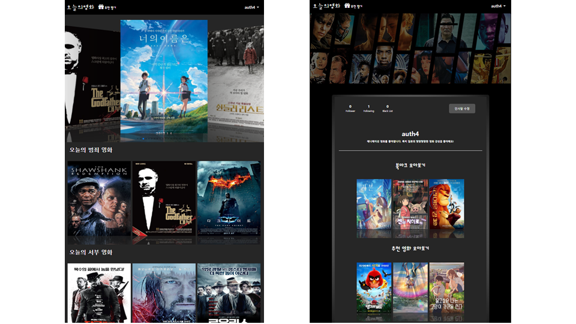
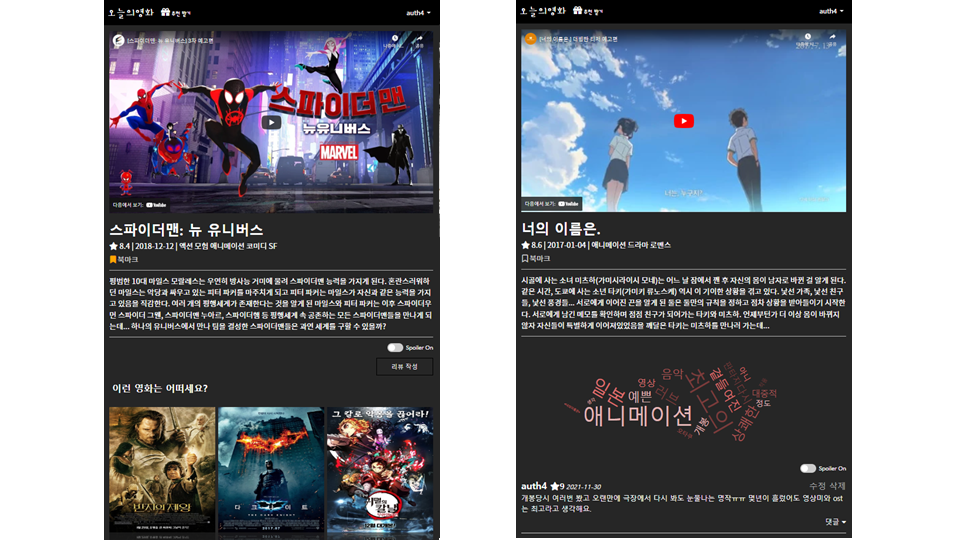

# 오늘의 영화 (TodayCinema)

> 본 프로젝트는 **새로운 기술을 적용하는 프로젝트** 용도로 사용 중 입니다.
>
> 따라서, 지속적으로 새로운 기술이 도입됩니다. 
>
> 아래 배포 버전을 확인하셔서 원하는 기술에 맞는 코드를 확인하시기 바랍니다.

## :movie_camera: This Project

모든 사람이 자주 영화를 보는것은 아닙니다. 하지만 대부분의 영화 커뮤니티는 '단골'을 타겟하여 서비스를 제공합니다. 그렇다면 **가끔 영화가 보고싶어졌을 때 찾아갈 서비스가 있다면 어떨까요?** 저희는 이 고민으로부터 프로젝트를 출발하였습니다. 

본 서비스는 가끔 오는 사람들을 위해 `오늘의 영화`를 추천해 드립니다. 16강 영화 월드컵을 통해 심심함을 달래며, 기존 정보가 없더라도 알맞는 `오늘의 영화`를 추천받을 수 있습니다. 추천받은 영화 리뷰를 빠르게 검토하기 위해 `워드클라우드`를 제공하며, `스포일러`에 안전한 리뷰를 보여드립니다. 그럼 **모든 형태의 사용자가 최고의 서비스**를 누리는 저희 프로젝트를 자세히 소개합니다.

## 🔥 Features

- 영화를 선택하는데 필요한 **정보와 커뮤니티를 제공**합니다.
- 영화 정보 + 리뷰 + 티저 영상을 하나의 페이지에서 확인함으로써 **몰입감**을 해치지 않습니다.
- 영화 리뷰를 **워드 클라우드**로 제작하여 한눈에 파악할 수 있습니다.
- **스포일러와 블랙리스트 필터**를 통해 더욱 쾌적한 커뮤니티 환경을 제공합니다.
- 영화 월드컵을 기반으로 **비슷한 장르 영화를 추천**해드립니다.

## :camera: Thumbnail

## 🗂️ Release

| Version    | Tools                         | Release Date      | Source          | Detail                         |
| ---------- | ----------------------------- | ----------------- | --------------- | ------------------------------ |
| 1.0.1 (v1) | Django, Vue.js, SQLite        | November 30, 2021 | [Source](/ver1) | [Detail Note](/ver1/README.md) |
| 2.0.1 (v2) | Spring, Django, Vue.js, MySQL | May 29, 2022      | [Source](/ver2) | [Detail Note](/ver2/README.md) |

## 📄 Dev Story

- [아이템 기반 추천 모델 서빙](https://sunshower99.tistory.com/13)
- [NLP 워드 클라우드](https://sunshower99.tistory.com/12)

