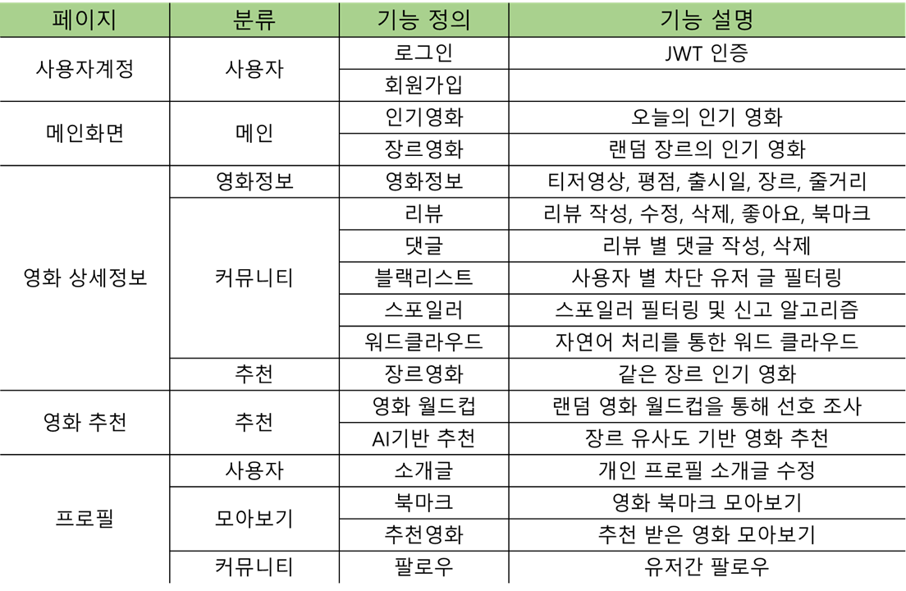

# 오늘의 영화 (TodayCinema)

[](https://github.com/ycyoondev/JORLDY/blob/master/LICENSE)

모든 사람이 자주 영화를 보는것은 아닙니다. 하지만 대부분의 영화 커뮤니티는 '단골'을 타겟하여 서비스를 제공합니다. 그렇다면 **가끔 영화가 보고싶어졌을 때 찾아갈 서비스가 있다면 어떨까요?** 저희는 이 고민으로부터 프로젝트를 출발하였습니다. 

본 서비스는 가끔 오는 사람들을 위해 `오늘의 영화`를 추천해 드립니다. 16강 영화 월드컵을 통해 심심함을 달래며, 기존 정보가 없더라도 알맞는 `오늘의 영화`를 추천받을 수 있습니다. 추천받은 영화 리뷰를 빠르게 검토하기 위해 `워드클라우드`를 제공하며, `스포일러`에 안전한 리뷰를 보여드립니다. 그럼 **모든 형태의 사용자가 최고의 서비스**를 누리는 저희 프로젝트를 자세히 소개합니다.

## ❗ Abstract

### 개발 툴


### 기능




## 🔍 How to

### 사용자 몰입을 위한 페이지 구성

사이트가 계속 새로고침되고, 원하는 정보를 얻기위해 이리저리 페이지를 이동해야된다면 사용자는 집중도가 떨어질 것입니다. 저희는 사용자의 몰입을 유지하기위해 사용자가 필요로하는 기능을 하나의 페이지에 담도록 설계하였습니다. 

영화 사이트에서 커뮤니티의 핵심은 특정 영화 정보에 느낀점을 표현하고 공유하는 것입니다. 즉, 영화를 찾는 사용자는 영화 정보와 거기에 담긴 리뷰를 한번에 파악하고 싶습니다. 따라서 영화 세부정보와 커뮤니티를 한 페이지에 구성하였습니다. 이를 통해 사용자는 영화에 대한 자세한 정보와 리뷰를 하나의 페이지에서 몰입해서 획득할 수 있습니다. 그리고 아래 비슷한 다른 영화로 이동이 가능하게 하여 지속적인 컨텐츠 소모를 유도하였습니다.

글쓰기와 같이 정보를 수정하는 과정에서 페이지가 이동하면 몰입에 방해가 됩니다. 저희는 모달창을 활용하여 글쓰기와 수정 기능을 구현하였으며, Accordion 기능을 통해 부드럽게 댓글을 확인할 수 있게 하였습니다.

### 영화 추천 시스템

단순 평점을 기반으로한 추천은 모집단의 수가 적으면 외곡이 발생한다는 단점이 있습니다. 예를들면 한명이 10점을 준 영화가 1위를 차지하게 됩니다. 따라서 평점 이외에 컬럼을 ML 학습하여 추천 모델을 구현하였습니다.

sklearn의 `CountVectorizer`와 `cosine_similarity` 를 이용한 **콘텐츠 기반 필터링 추천 모델**입니다. DB에 제공되는 데이터 컬럼 중 장르가 선호도에 미치는 영향이 가장 클것으로 판단하여, 장르를 기반으로 모델링을 진행합니다.

Pandas DF로 전처리 및 토큰화하여 별도 컬럼을 생성합니다. 이를 `CountVectorizer`를 통해 출현 빈도 벡터화 합니다. 이때 자동 소문자화가 진행됩니다. 다음으로 `cosine_similarity`를 이용해 벡터간의 유사도를 학습하고, numpy를 이용해 유사도가 높은 순서로 정렬하여 추천 영화를 추출하였습니다.

부가적으로, 우리는 미처 학습하지 못한 영화가 선정될 결과를 대비하여 `tmdb`에서 기본적으로 제공되는 추천 기능을 제공합니다. 이를 통해 유저들은 모든 영화에 대하여 안정적으로 추천 영화를 제공받을 수 있습니다.

> Ref. https://www.kaggle.com/tmdb/tmdb-movie-metadata/code

### 워드 클라우드

사용자는 빠르게 리뷰를 통해 원하는 정보를 얻고 싶습니다. 따라서 좋은 서비스는 데이터를 가공하여 정보를 얻는 시간을 줄여야합니다. 효과적인 리뷰 요약을 위해 워드 클라우드 기능을 구현하였습니다. 

중심 알고리즘은 단순 단어 빈도수 측정이 아닌, **비지도학습 알고리즘**을 이용해 핵심 키워드를 나타나게 하였습니다. 이는 HITS 추천 알고리즘과 유사한 원리입니다. 모델 성능은 리뷰가 적은 상황에서 한국어 자연어 처리의 고질적인 문제인 L/R 구별이 잘 진행되지 않습니다. 하지만 리뷰 수가 증가할 수록 이러한 문제는 빠르게 해소되었습니다. 

> Ref. https://github.com/lovit/KR-WordRank

### 스포일러

 볼 만한 영화를 찾고 있는데, *'마지막에 다 죽음'* 과 같은 스포일러를 보게 된다면 어떨까요? 흥이 팍 식어버릴 겁니다. 따라서 우리는 영화 상세 페이지에서 스포일러를 제외한 리뷰를 제공합니다. 리뷰 작성자는 리뷰를 작성할 때 해당 리뷰가 스포일러인지 아닌지를 체크합니다. 이렇게 하면 기본적으로 제공하는 리뷰 목록에서 해당 리뷰는 제외됩니다. 물론, 원한다면 `Spoiler On` 버튼을 토글하여 스포일러가 포함된 리뷰를 확인할 수도 있죠!
 하지만, 모든 유저가 양심적인 것은 아닙니다. 악의적으로 스포일러 체크를 하지 않는 사람도 있고, 실수로 체크하지 못하는 경우도 있겠죠. 따라서 해당 리뷰가 스포일러인지를 판단하기 위해 다른 유저의 의견도 반영합니다. 일종의 **신고 기능**이죠! 리뷰 좋아요 버튼과 함께 제공되는 스포일러 신고 버튼을 누르면 DB에 해당 내용이 기록됩니다. 그리고 몇 명이 해당 리뷰를 신고했는지 표시하며, 신고가 10건 이상 접수되면! *짜잔!* 해당 글이 자동적으로 스포일러로 변환됩니다! 신고 버튼을 잘못 누르셨다구요? 그렇다면 다시 한 번 눌러 취소하시면 됩니다! 간단하죠.
 하지만, 그렇다고 스포일러였던 리뷰가 다시 일반 리뷰로 변환되는 것은 아닙니다. 스포일러에서 일반 리뷰로, 그리고 일반 리뷰에서 스포일러로 변환되는 과정은 신중해야 하죠. 따라서 우리는 스포일러 신고를 총 15건까지 누적하며, 스포일러였던 리뷰가 일반 리뷰로 다시 변환되기 위해서는 신고가 6건까지 줄어들어야 합니다. 이 정도면, 누군가 장난으로 하나의 리뷰를 스포일러와 일반 글 사이에서 춤추게 하는 일은 막을 수 있을 것입니다.

### 블랙리스트

 유난히 나와 맞지 않는 성향을 가진 유저를 본 적 있지 않으신가요? 그렇다고 그 유저의 리뷰만 제외하고 볼 수 있는 것도 아니고, 참 곤란합니다... 네? 뭐라고요? 할 수 있다고요? 
 네! 그렇습니다! 우리는 보기 싫은 유저의 리뷰가 제거된 ~~편안한~~ 리뷰 목록을 제공합니다! 불편한 리뷰를 만난다면, 앞으로는 그냥 리뷰에서 해당 유저의 이름을 눌러 프로필에 들어간 후 블락 버튼을 누르기만 하면 됩니다. 그러면 당신의 블랙 리스트에 해당 유저가 추가되고, 앞으로 해당 유저의 리뷰가 당신의 시야에 들어와 기분이 나빠질 일은 없을 겁니다! 우리는 즐거운 글만 보기에도 바쁘니까요!

### 데이터베이스

우리는 DB를 좀 더 크게 만들고 싶었습니다. `tmdb`에 있는 영화들은 너무 많았고, 우리의 DB는 너무나도 작고 소중했죠. 우리에게 개발이 종료된 뒤 몇 년이 지나도 고정된 DB를 가지는 영화 추천 사이트는 너무나도 초라해 보였습니다. 따라서 가변적으로 DB에 영화 데이터를 추가하고, 갱신할 수 있는 시스템을 만들었습니다! `Admin`은 url을 통해 간편하게 DB에 영화 데이터를 갱신할 수 있고, 현재 DB에 저장되어 있지 않은 영화라도 `tmdb_id`만 있다면 간단하게 영화 데이터를 DB에 추가할 수 있습니다. 이를 통해 현재 DB에 저장되어 있지 않은 영화도 추천 로직을 통해 `tmdb_id`를 얻는다면 얼마든지 DB에 추가하여 이후로는 간단하게 정보를 제공할 수 있습니다.
 또한 우리는 DB에서 정보를 제공할 때도 최대한 필요한 정보만을 `serialize`하여 제공합니다. 불필요한 연산을 줄이는 것을 통해 유저들은 DB에 접근할 때 더욱 빠르게 접근할 수 있을 것입니다.


## 📄 Entity Relationship Model (ERD)


## 👥 Contributors

### 윤영철

Frontend, Machine Learning

### 이호형

Backend, Database Administer

## 🗂️ Release

AWS 배포 완료


---


## ⬇️ Installation

### For Server

```
 $ git clone https://github.com/TodayCinema/backend.git
 $ cd backend
 $ pip install -r requirements.txt
```

**To use Virtual Environments**

(customize if necessary)

```
 $ cd backend
 $ python -m venv venv
 $ source venv/Scripts/activate/
 $ pip install -r requirements.txt
```

### For Client

```
 $ git clone https://github.com/TodayCinema/frontend.git
 $ cd frontend
 $ npm i
```


## 🚀 Getting started

### Key Setting

#### For Server

Server 폴더(venv위치)에 `_env.py` 파일을 생성 후 아래 내용을 저장한다.

- SECRET_KEY는 Django settings.py에서 얻을 수 있다.
- ENV_TMDB_KEY는 TMDB API에서 발급받을 수 있다.

```
SECRET_KEY = 
ENV_TMDB_KEY = 
```

#### For Client

Root 폴더(.git위치)에 `.env.local`파일을 생성 후 아래 내용을 저장한다. 

아래 값은 예시이며, 해당하는 로컬 주소나 배포된 주소를 입력하면 된다.

```
VUE_APP_SERVER_URL=http://127.0.0.1:8000
```

### 실행

#### For Server

```
$ python manage.py migrate
$ python manage.py loaddata TodayCinemaDumpdata.json
$ python manage.py runserver
```

#### For Client

```
$ npm run serve
```


## :v: TEST 주의사항(fixture)

* 리뷰와 코멘트의 스포일러 등의 특이점은 id: `admin` pw: `admin` 계정에서 테스트할 수 있게끔 `fixture`가 마련되어 있습니다. 
* `fixture`는 영화 정보 제공, 즉 `Index` 페이지의 최상단 `MovieSlider` 슬라이드가 로드되자마자 중앙으로 보이는 세 개의 영화`(대부, 갓핸드, 너의 이름은.)`을 중심으로 제공되어 있습니다. 외에는 리뷰와 댓글이 작성되어 있지 않습니다.
* 외 유저들은 *대부분* id: `t{number}` pw: `just{'number'*4}`로 설정되어 있습니다. 예를 들어 id: `t1` pw: `just1111`과 같은 식입니다. 다만 두 자리수 `number`에 대해서는 id: `t17` pw: `just1717`의 형태로 pw에서 두 번 반복의 형식입니다.


## ©️ License

[Apache License 2.0](https://github.com/ycyoondev/JORLDY/blob/master/LICENSE.md)

