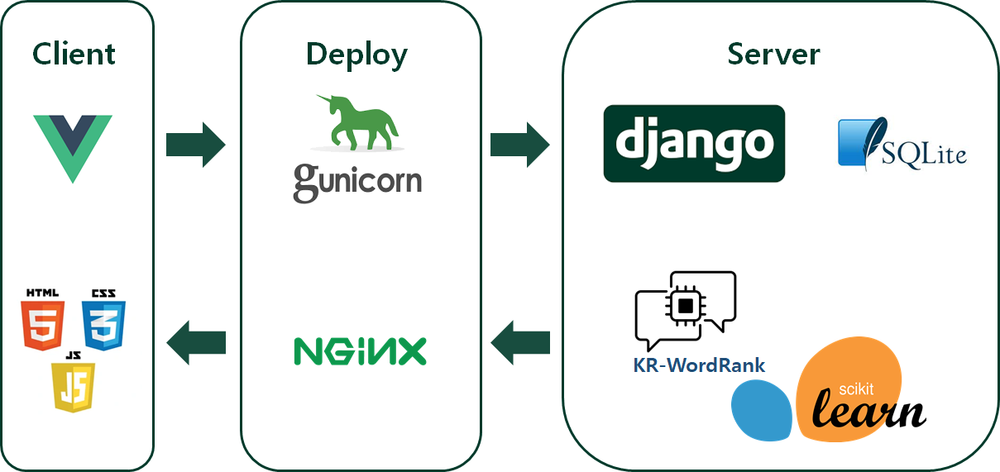
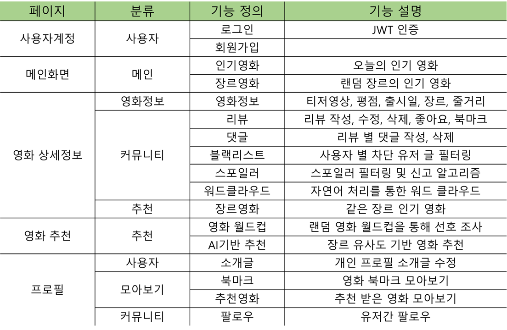
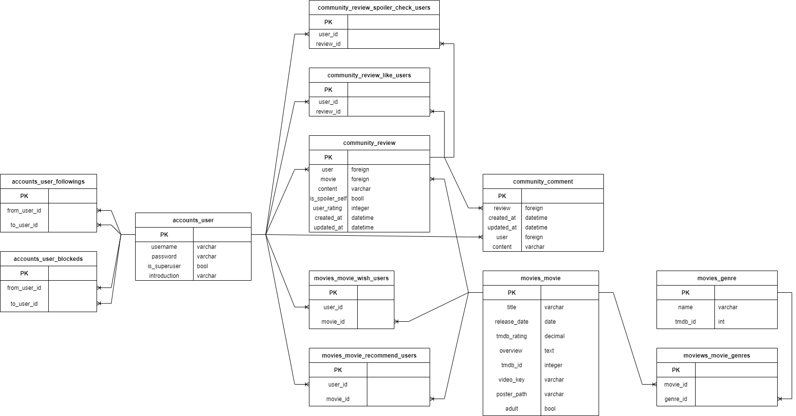

# 오늘의 영화 (TodayCinema) Ver.1

## ❗ Abstract

> **(21.11.29)**
>
> **Baceknd (Ver. 1) 입니다. SSAFY 교육 프로젝트를 위해 2명이 팀으로 개발하였습니다.**

### 개발 툴



### 기능




## 📄 Entity Relationship Model (ERD)




## 👥 Contributors

### 윤영철

**Frontend, Machine Learning**

FE 개발 전체와 2개의 ML 모델 학습 및 서빙을 담당했습니다.

### 이호형

**Backend, Database Administer**

BE 개발에서 ML 서빙을 제외한 모든 부분을 개발하고, ERD를 설계하였습니다.

## 🗂️ Release

AWS 배포 (현재 비용 문제로 OFF 상태 입니다.)


---


## ⬇️ Installation

### For Server

```
 $ git clone https://github.com/TodayCinema/backend.git
 $ cd backend
 $ pip install -r requirements.txt
```

**To use Virtual Environments**

(customize if necessary)

```
 $ cd backend
 $ python -m venv venv
 $ source venv/Scripts/activate/
 $ pip install -r requirements.txt
```

### For Client

```
 $ git clone https://github.com/TodayCinema/frontend.git
 $ cd frontend
 $ npm i
```


## 🚀 Getting started

### Key Setting

#### For Server

Server 폴더(venv위치)에 `_env.py` 파일을 생성 후 아래 내용을 저장한다.

- SECRET_KEY는 Django settings.py에서 얻을 수 있다.
- ENV_TMDB_KEY는 TMDB API에서 발급받을 수 있다.

```
SECRET_KEY = 
ENV_TMDB_KEY = 
```

#### For Client

Root 폴더(.git위치)에 `.env.local`파일을 생성 후 아래 내용을 저장한다. 

아래 값은 예시이며, 해당하는 로컬 주소나 배포된 주소를 입력하면 된다.

```
VUE_APP_SERVER_URL=http://127.0.0.1:8000
```

### 실행

#### For Server

```
$ python manage.py migrate
$ python manage.py loaddata TodayCinemaDumpdata.json
$ python manage.py runserver
```

#### For Client

```
$ npm run serve
```


## ©️ License

[Apache License 2.0](https://github.com/ycyoondev/JORLDY/blob/master/LICENSE.md)

