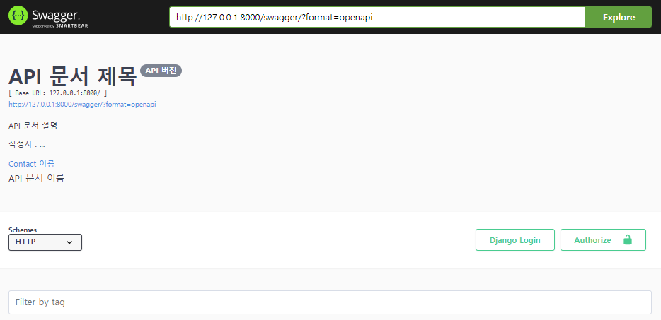

# [drf-yasg] RESTful API 문서 만들기

### 배경

Django로 개발한 서버를 Spring 서버로 변경하려 합니다. Django 서버 API를 하나하나 파악하는것은 효율적이지 못하므로, 자동 문서화 도구를 사용해서 적용된 API를 파악하겠습니다. 

### 목표

Django REST API Docs 도구인 drf-yasg를 사용하여 문서화 하겠습니다.

### 과정

#### 환경 설정

1. 라이브러리 설치

```bash
pip install drf-yasg
```

2. setting.py 

```python
INSTALLED_APPS = [
    ...
    'drf_yasg',
]
```

3. url 등록

```python
from django.contrib import admin
from django.urls import path, include

# drf-yasg
from drf_yasg.views import get_schema_view
from drf_yasg import openapi
from rest_framework import permissions

urlpatterns = [
    path('admin/', admin.site.urls),
    '''
        서비스에 사용되는 url
    ''',
]

schema_view = get_schema_view(
    openapi.Info(
        title='API 문서 제목',
        default_version='API 버전',
        description=
        '''
        API 문서 설명

        작성자 : ...
        ''',
        terms_of_service='',
        contact=openapi.Contact(name='이름', email='이메일'),
        license=openapi.License(name='API 문서 이름')
    ),
    public=True,
    permission_classes=(permissions.AllowAny,),
    patterns=urlpatterns,
)

# drf_yasg url 
urlpatterns += [
    path('swagger<str:format>', schema_view.without_ui(cache_timeout=0), name='schema-json'),
    path('swagger/', schema_view.with_ui('swagger', cache_timeout=0), name='schema-swagger-ui'),
    path('redoc/', schema_view.with_ui('redoc', cache_timeout=0), name='schema-redoc'),
]
```

4. 접속

```python
python manage.py runserver
```

`http://127.0.0.1:8000/swagger/` 또는 `http://127.0.0.1:8000/redoc/` 접속하여 확인

### 결과




Swagger와 Redoc 타입 중 보기좋은 UI를 선택해 사용하면 된다. 화면에서 API를 호출해서 테스트할 수 있다.  

