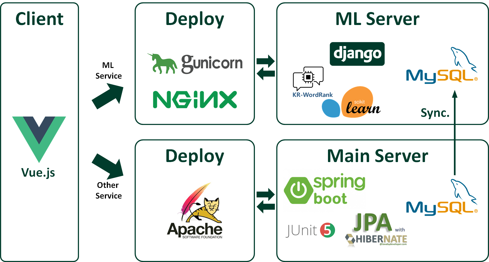

# 오늘의 영화 (TodayCinema) Ver.2

## ❗ Abstract

> **22.05.29**
>
> **Baceknd (Ver. 2) 입니다. 이전 버전에서 Main Server를 Spring으로 전환하고, ML 서버로 Django를 운영하는 방식으로 변경했습니다. DB를 SQLite에서 MySQL로 전환하였습니다.**

### 개발 툴




### 기능 (ver1 동일)


## 📄 Entity Relationship Model (ERD)


## 👥 Contributors

개인 프로젝트 (단독 개발)


## 🗂️ Release

Oracle Cloud 배포


---


## ⬇️ Installation

### For Spring Server

```
 $ git clone https://github.com/ycyoondev/today-cinema.git
 $ cd ver2/spring-server
 $ gradlew build
```


### For Django Server

```
 $ git clone https://github.com/ycyoondev/today-cinema.git
 $ cd ver2/django-server
 $ pip install -r requirements.txt
```

**To use Virtual Environments**

(customize if necessary)

```
 $ python -m venv venv
 $ source venv/Scripts/activate/
 $ pip install -r requirements.txt
```


### For Client

```
 $ git clone https://github.com/ycyoondev/today-cinema.git
 $ cd frontend
 $ npm i
```


## 🚀 Getting started

### Key Setting

#### For Spring Server

Server 폴더에 `application.yml` 파일을 생성 후 아래 내용을 저장한다.

- spring.datasource는 DB 연결 정보를 입력한다.
- spring.jpa는 hibernate설정을 입력한다.
- tmdb_key는 TMDB API에서 발급받을 수 있다.

```
### application.yml
spring:
  datasource:
  jpa:
logging.level:
  org.hibernate.SQL: debug
  org.hibernate.type: trace

springdoc:
  swagger-ui:
    path: swagger.html
  version: v2
  paths-to-match:
  - /v2/**

server:
  port: 8001

tmdb_key:
jwt_secret:
django_url:
```


#### For Django Server

Server 폴더(venv위치)에 `_env.py` 파일을 생성 후 아래 내용을 저장한다.

- SECRET_KEY는 Django settings.py에서 얻을 수 있다.

```
### _env.py
SECRET_KEY = 
```

Server 폴더(venv위치)에 `db_settings.py` 파일을 생성 후 아래 내용을 저장한다.

```
### db_settings.py
DATABASES = {
    'default' : {
        'ENGINE': 'django.db.backends.mysql',    
        'NAME': ,                  
        'USER': ,                          
        'PASSWORD': ,                  
        'HOST': ,                     
        'PORT': ,                          
    }
}
```


#### For Client

Root 폴더(.git위치)에 `.env.local`파일을 생성 후 아래 내용을 저장한다. 

아래 값은 예시이며, 해당하는 로컬 주소나 배포된 주소를 입력하면 된다.

```
VUE_APP_SERVER_URL_DJANGO=http://127.0.0.1:8000/v2
VUE_APP_SERVER_URL_SPRING=http://127.0.0.1:8001/v2
```


### 실행

#### For Server

```
### django-server
$ python manage.py migrate
$ python manage.py runserver

### spring-server/build/libs
$ java -jar hello-spring-0.0.1-SNAPSHOT.jar
```


#### For Client

```
$ npm run serve
```

